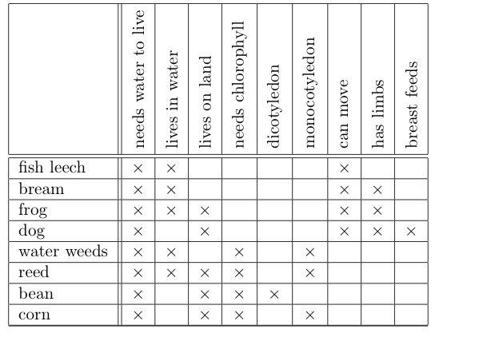

# Formal Concept Analysis 
[origin page](https://golem.ph.utexas.edu/category/2013/09/formal_concept_analysis.html)

author: Simon Willerton

FCA (Formal Concept Analysis) 是用来提取对象间共同特征的关系和层次结构.我们以一个具体的例子来理解这个抽象的定义.

大多数的FCA形式表示如下: 1) 输入的对象集合**G**; 2) 特征集合**M**; 3) 以及用来表示一个对象含有某种特征的关系集合**I**. 形如*(G, M, I)*的三元形式称为**formal concept**, 长以表格的形式表达.

FCA的分析结果称为*概念格（concept lattice)* (来自德语 ‘Berriffsverband’)。
>This is a lattice, which means it is a poset in which each pair of elements have a greatest lower bound and a least upper bound.

概念格表达了对象和特征之间的关系。下图是上述示例的概念格。

